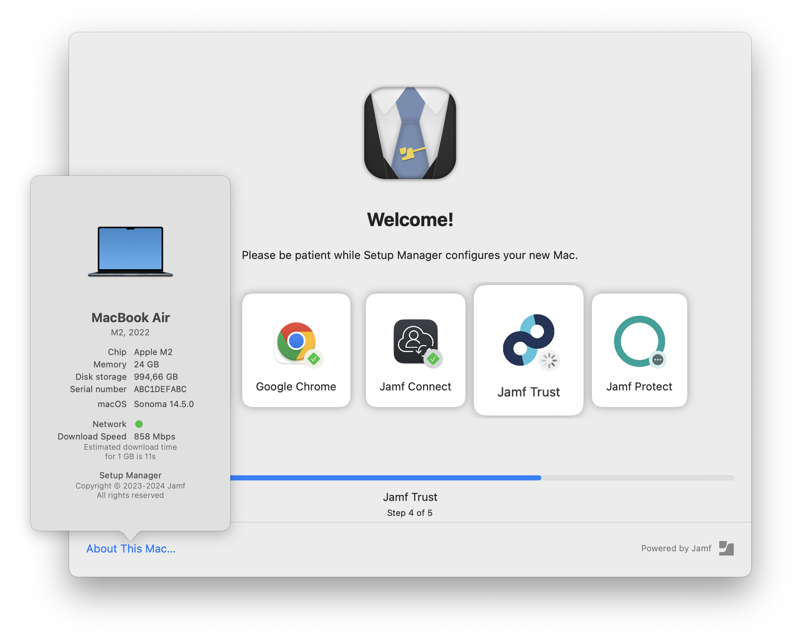

#  Setup Manager

_"Every Assistant has a Manager"_

Please report issues, feature requests [as an issue.](https://github.com/Jamf-Concepts/Setup-Manager/issues)

We have opened the [discussions](https://github.com/Jamf-Concepts/Setup-Manager/discussions) area for questions and more generic feedback.

Updates will be published in the '[Releases](/releases)' section of the repo. There you can also [download the latest pkg installer](https://github.com/Jamf-Concepts/Setup-Manager/releases/latest). You can subscribe to notifications for the repo using the 'Watch' button above. 

## What it does

There are many enrollment progress tools available for Mac admins, each with their own strengths. Jamf Setup Manager approaches the problem from the perspective of an IT service provider.

Setup Manager offers many of the same features of these utilities but is especially useful for the case where an IT department or provisioning depot wants to ensure that a new Mac is properly configured and assigned before sending the device to its new user. It runs over Setup Assistant before a user is created so it won't interfere with MDM-capable user or the secure token flow for FileVault. You can control which policies and installations Setup Manager runs with a configuration profile.

Setup Manager provides:
- a nice modern UI
- configuration with a configuration profile, no need to modify shell scripts or json
- works with different deployment workflows
  - zero-touch (user-driven)
  - single-touch (tech-driven)
  - user initiated enrollment
- customized branding
- localized interface and custom text
- support for Jamf Pro and Jamf School

## Installation and Configuration

### Jamf Pro

1. Upload the Setup Manager installer pkg file to Jamf Pro
2. Create a custom configuration profile with the preference domain `com.jamf.setupmanager`. See documentation for the profile contents [here](ConfigurationProfile.md).
3. Scope the configuration profile to the computers
4. Add the pkg and the configuration profile to the Prestage

Setup Manager can be used for various zero-touch and tech-driven single-touch deployments with Jamf Pro and (optionally) Jamf Connect. One single-touch workflow with Jamf Connect where the tech can re-assign the Mac to a different end user [is described here](JamfProConnect-SingleTouch.md).

### Jamf School

[Setup with Jamf School](Setup-JamfSchool.md)

## Configuration Profile

The structure of the configuration profile [is documented here](ConfigurationProfile.md).

## Notes

### Requirements

Setup Manager requires macOS 12.0.0 or higher. It will work only with Jamf Pro or Jamf School.

### Known Issues

- Setup Manager will **_not_** launch with Auto-Advance enabled
- Setup Manager may **_not_** launch when you disable _all_ Setup Assistant screens

### Quit

The command-Q keyboard short cut to quit the app is disabled. You can use shift-control-command-E instead. This should only be used when debugging as it may leave the client in an undetermined state when installations are aborted.

### Logging

Setup Manager logs to `/Library/Logs/Setup Manager.log`.

While it is running you can open a log window with command-L.

### Flag file

Setup Manager creates a flag file at `/private/var/db/.JamfSetupEnrollmentDone` when it finishes. If this file exists when Setup Manager launches, the app will terminate immediately and withour taking any action. You can use this flag file in an extension attribute in Jamf to determine whether the enrollment steps were performed. (Setup Manager does not care if the actions were performed successfully.)

When DEBUG is set to YES in the defaults/configuration profile, the flag file is ignored at launch, but still created when done.

### Final action and shutdown

When the app is not running as root (for testing or from Xcode) or when the `DEBUG` preference is set, shutdown will merely quit.

### "About This Mac…" window

When you hold the option key when clicking on "About This Mac…" you will see more information.

Please report issues, feature requests, and feedback (positive and negative) [as an issue.](https://github.com/Jamf-Concepts/Setup-Manager/issues)
